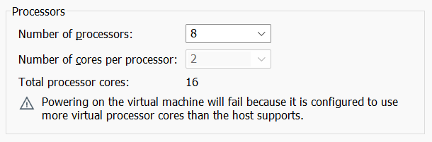
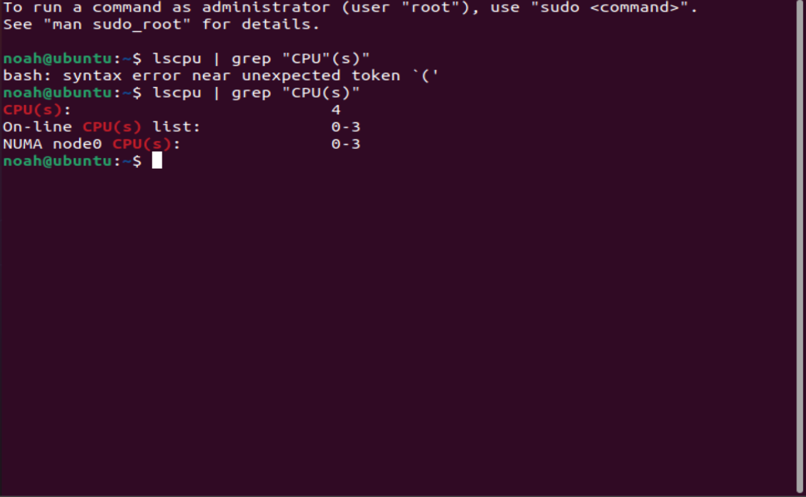
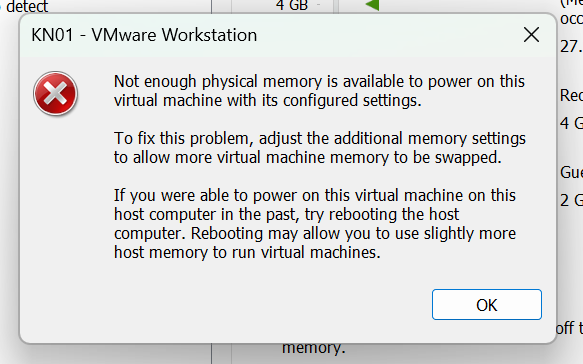
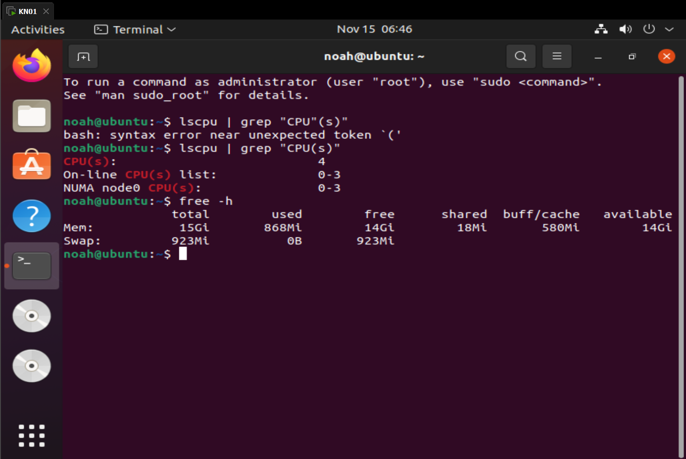

# A
## Hypervisor
Ein **Hypervisor** ermöglicht es, mehrere virtuelle Maschinen (VMs) auf einer Hardware gleichzeitig auszuführen. Es gibt zwei Typen:
### Typ 1 (Bare Metal):
 Läuft direkt auf der Hardware ohne Betriebssystem. Er ist leistungsstark, sicher und wird in Rechenzentren genutzt (z. B. VMware ESXi, Hyper-V).

### Typ 2 (Hosted):
 Läuft auf einem bestehenden Betriebssystem. Einfacher zu bedienen, aber weniger effizient (z. B. VirtualBox).

 --- 

### Unterschied
#### Typ 1
direkte Hardware-Nutzung
#### Typ 2
Abhängigkeit vom Host-OS

---

---
# B

## Vemutung zum Hypervisor Typ

Vermutlich habe ich den **Hyperevisor Type 2**, weil meine Virtuellen Machienen auf meinem Betriebssystem laufen

## Effektiver Hypervisor
Typ 2, weil wir nicht mehr RAM und CPU als der Host, bzw mein Laptop in eine VM stecken können.

--- 
## Eigenes Betriebsystem

- Logische Prozessoren: 12
- RAM: 32 GB

---

## VM Betriebssystem
Ubuntu

## Prozessoren Hinzufügen
Man konnte nicht mehr Prozessoren hinzufügen, als mein Laptop hat.

## lscpu | grep "CPU(s)"

## RAM hinzufügen
Man konnte nicht mehr RAM hinzufügen, als mein Laptop hat.

## free -h

---

### Vermutungen

Für mich ist es irgenwie Logisch, dass man nicht mehr Ram bzw. CPU auf einer VM laufen lassen kann als der Host.
Denn man kann keine Energie aus nichts holen.

#### Vermutung Auswertung

So wie es scheint Funktioniert es wie gedacht nicht.