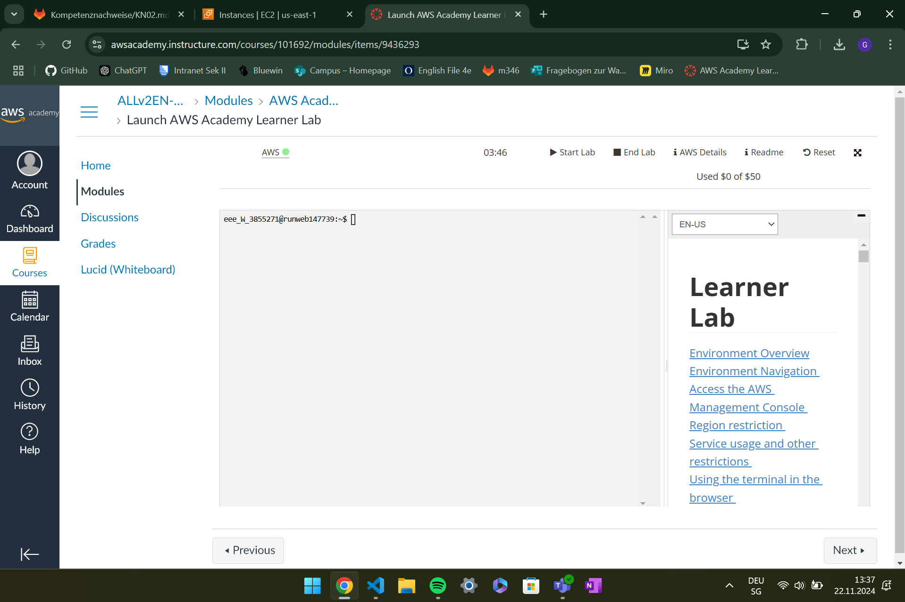
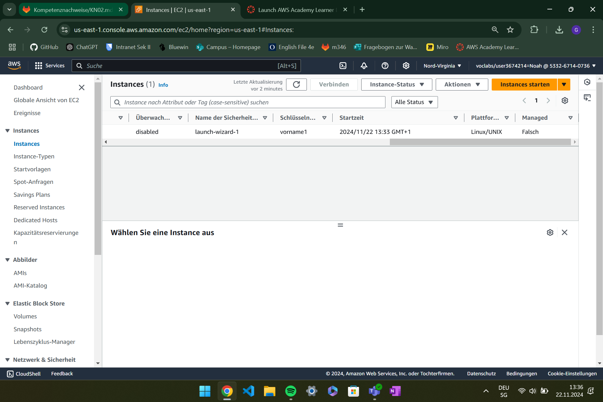
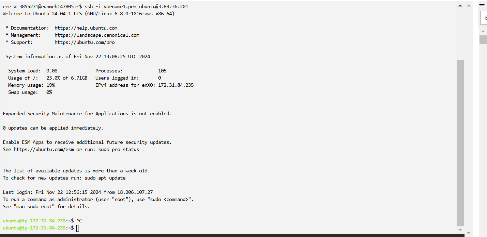
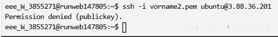
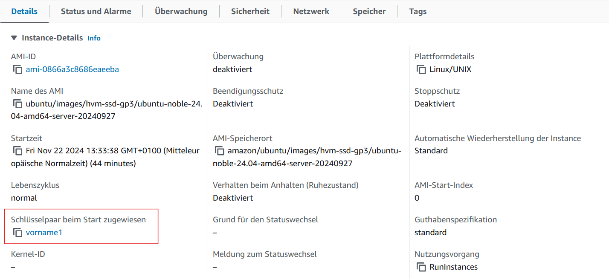

# A Umgang mit AWS Kurs

 ---

# B Instanz erstellen

## Instance
### Name
KN02
### OS Image
 Ubuntu 24.04
### Instanz-Typ
t2.micro
### Key-Pair
#### Key 1
 vorname1
#### Key 2
 vorname2

### Instance-ID
i-03d0135d3a62129f5

### Öffentliche IPv4-Adresse

3.88.36.201

### Private IPv4-Adressen
172.31.84.235

 --- 

## Name und ID

## IP

## Status

## Details
Die Disk hat eine Volumengrösse von 8 GiB.
Das Betriebsystem ist Ubuntu 24.04.
RAM-Datenträger-ID hat es nicht.
Es hat einen vCPU.

 --- 

## Schlüsselverbindung vorname1.pem

## Schlüsselverbindung vorname2.pem

## Schlüsseldetail beim Start

