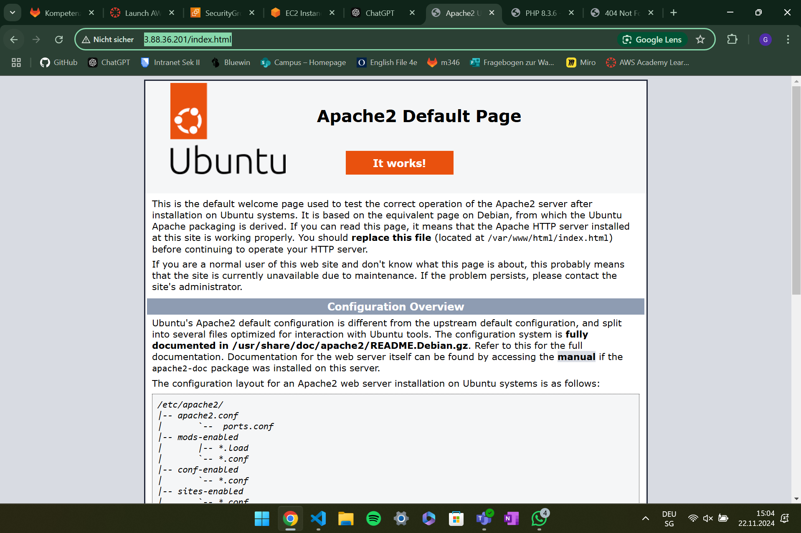
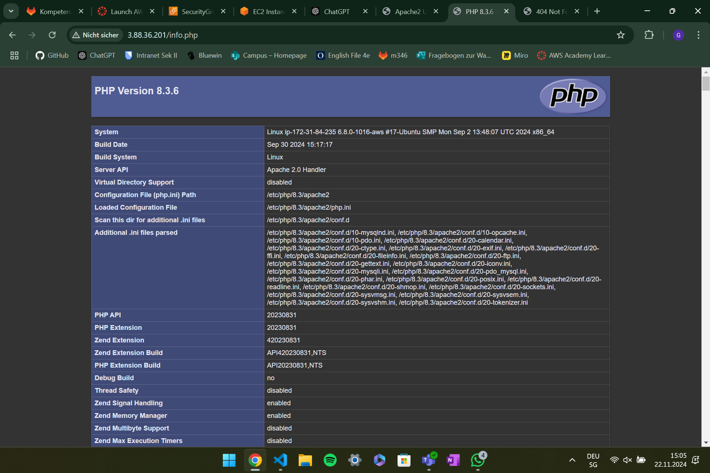
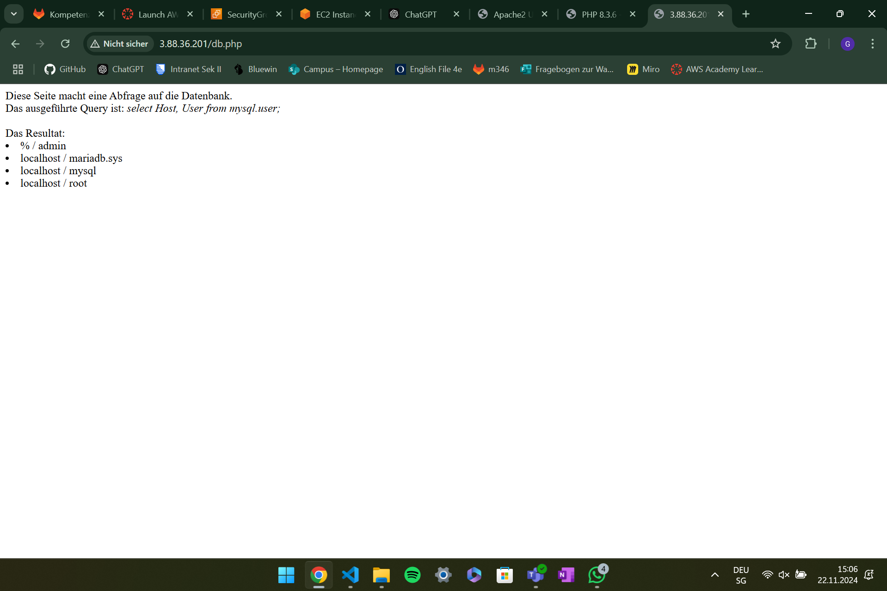
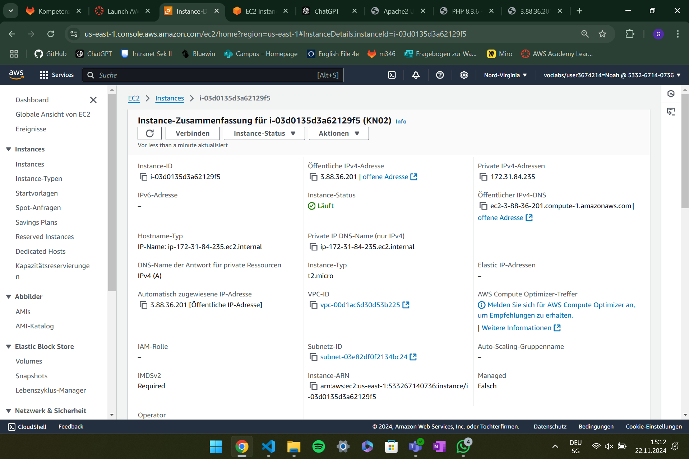
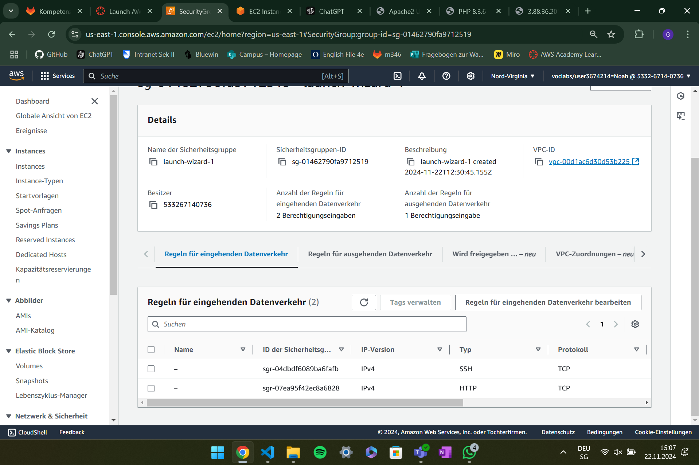
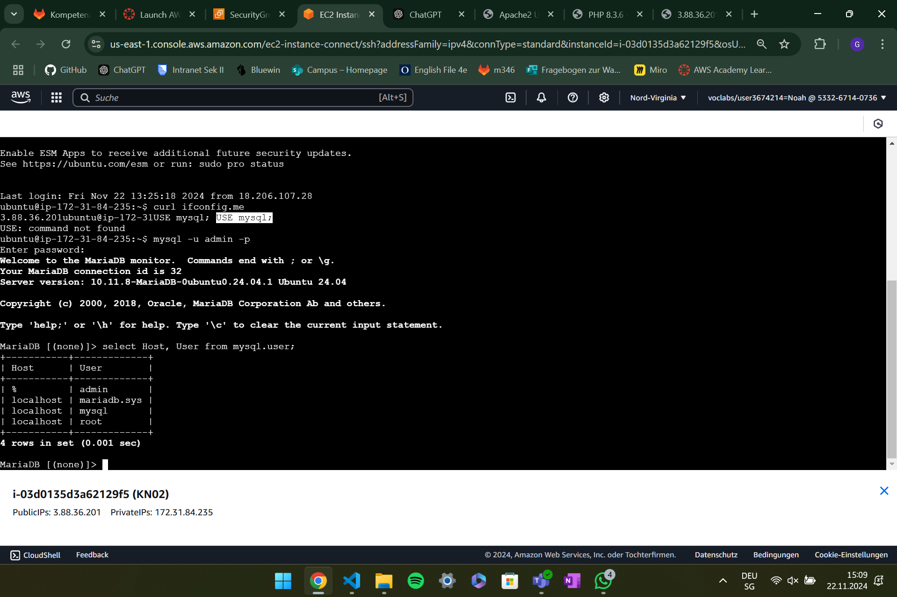

## funktionierenden Webseiten
### index.html

### info.php

### db.php

## Details der Instanz mit öffentlichen IP

## Regeln der Sicherheitsgruppe

## einloggen mysql Konsole und Resultat der Abfrage.

### Was macht die SQL Abfrage
#### Abfrage
**select Host, User from mysql.user;**
#### Beschreibung
Es wird der Host und der User von der datenbank mysql und der Tabelle User angezeigt.