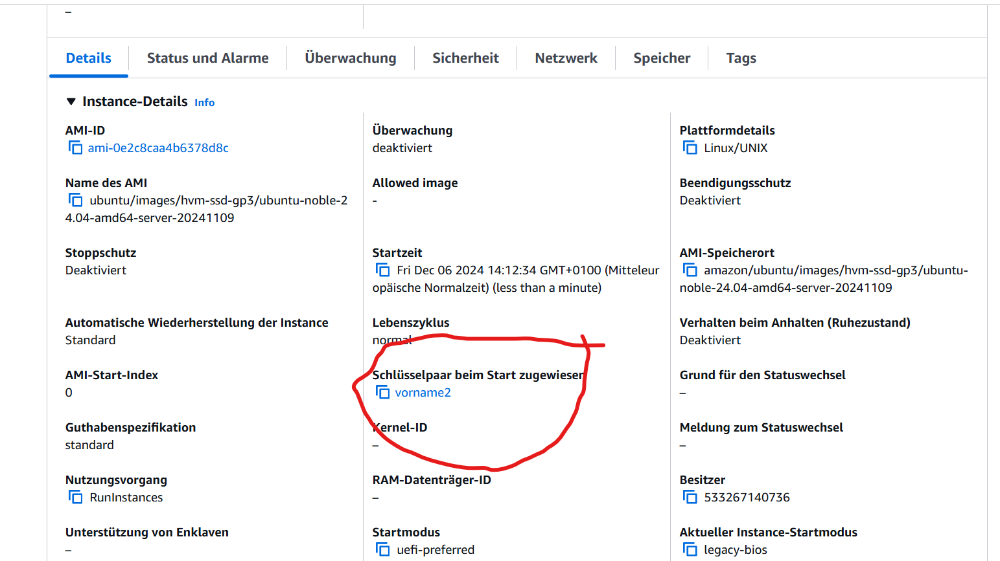
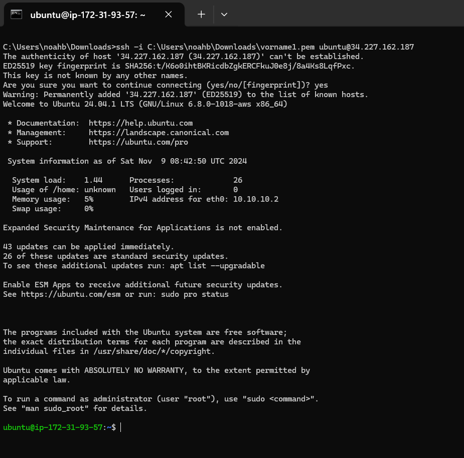
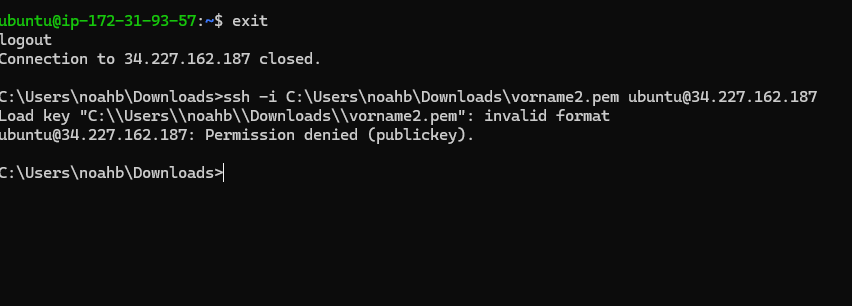
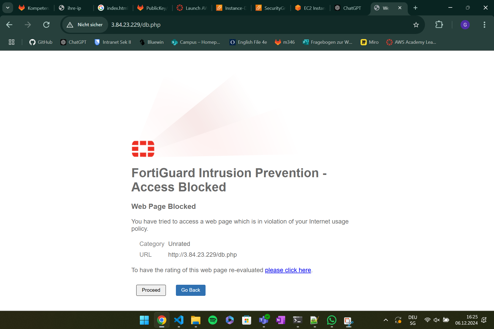
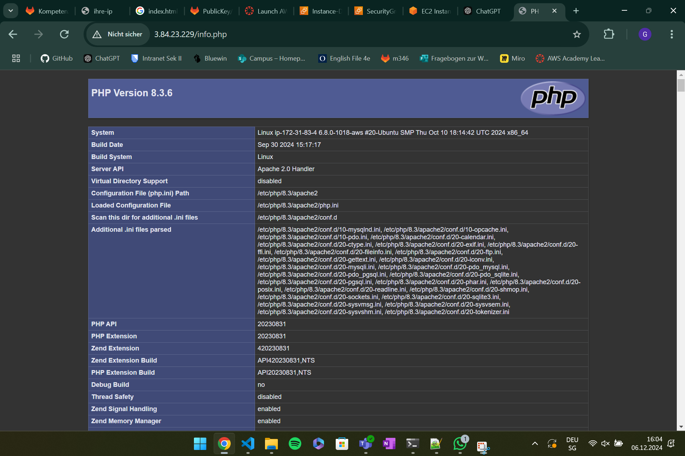
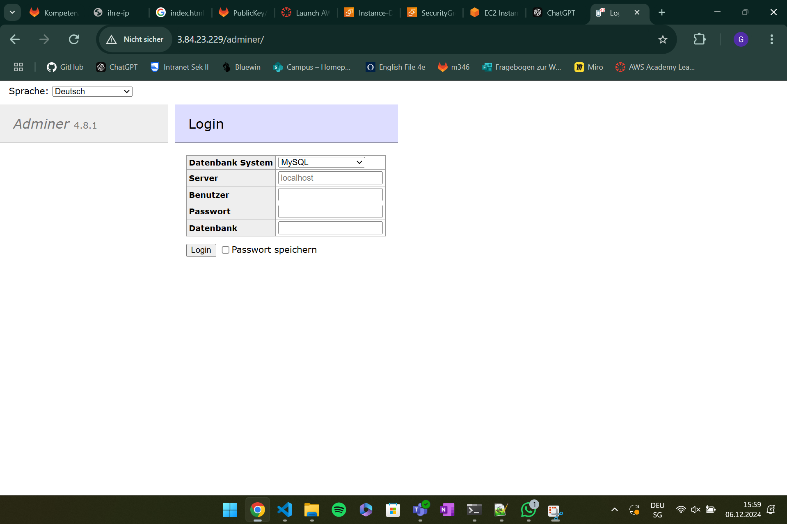
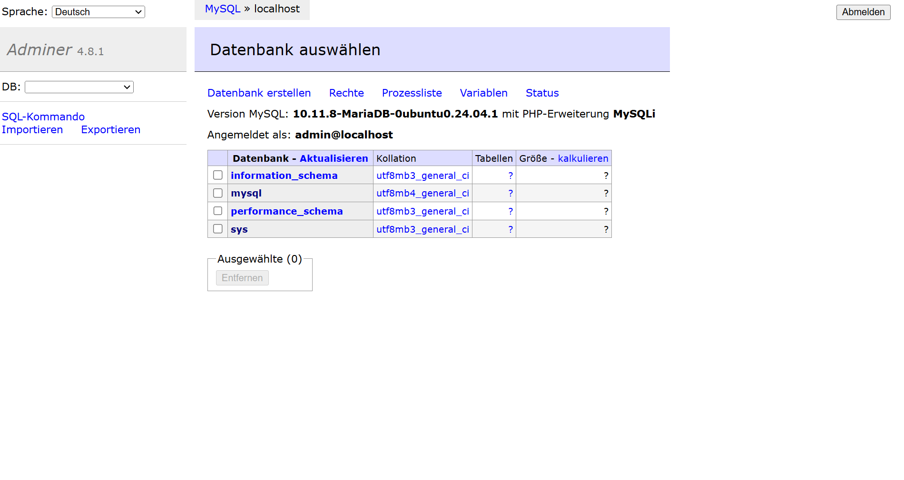

## A) Cloud-init Datei Verstehen
[cloud-init.yaml](./yaml/cloud-init.yaml)
## B) SSH-Key und Cloud-init
### angepasste Cloud-init Konfiguration
[cloud-init.yaml](./yaml/cloud-init.yaml)
### Key pair assigned at launch

### ssh-Befehl 1. Key Success

## ssh-Befehl 2. Key Denied

## Cloud Log

## C) Template 
### Template mit Lehrer Key
[cloud-init-template.yaml](./yaml/cloud-init-template.yaml)

## D)  Installation automatisieren

### Abgaben DB Server

### Abgaben Webserver
#### index.html

#### db.php

Ich konnte mich mit dem SQL von der Konsole aus anmelden und alles anzeigen lassen, die website hat es trotz allem nicht zugelassen
### info.php

### admirer

