# A) Cloud-init Datei Verstehen (10%)
[cloud-init.yaml](./yaml/cloud-init.yaml)

# B) SSH-Key und Cloud-init (15%)
## Ihre angepasste Cloud-init Konfiguration als Datei im Git-Repository.
[cloud-init.yaml](./yaml/cloud-init.yaml)
## Ein Screenshot der Details der Instanz. Scrollen Sie so weit runter, dass das Feld "Key pair assigned at launch", sichtbar ist.
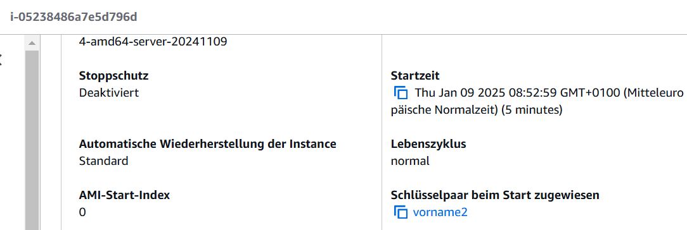
## Screenshot mit dem ssh-Befehl und des Resultats unter Verwendung des ersten Schlüssels.
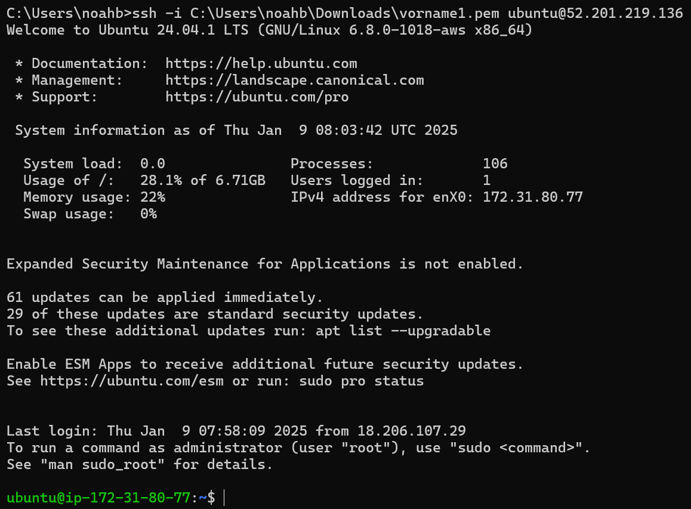
## Screenshot mit dem ssh-Befehl und des Resultats unter Verwendung des zweiten Schlüssels.
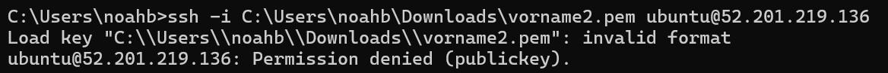
## Screenshot mit dem Auszug aus dem Cloud-Init-Log. Der Befehl den Sie aufgerufen haben um das Log darzustellen und der obere Teil des Logs sollten sichtbar sein. Sie müssen nicht das gesamte Log abgeben.
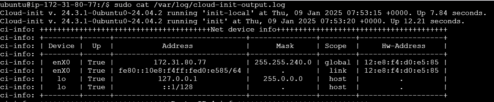

# C) Template (5%)
[cloud-init-temp.yaml](./yaml/cloud-init-temp.yaml)

# D) Installation automatisieren (70%)

### Abgaben DB Server
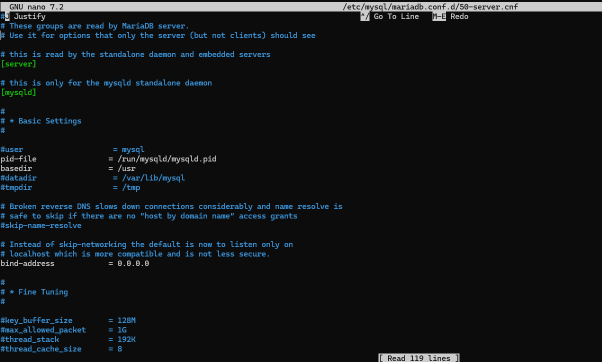
### Abgaben Webserver
#### index.html
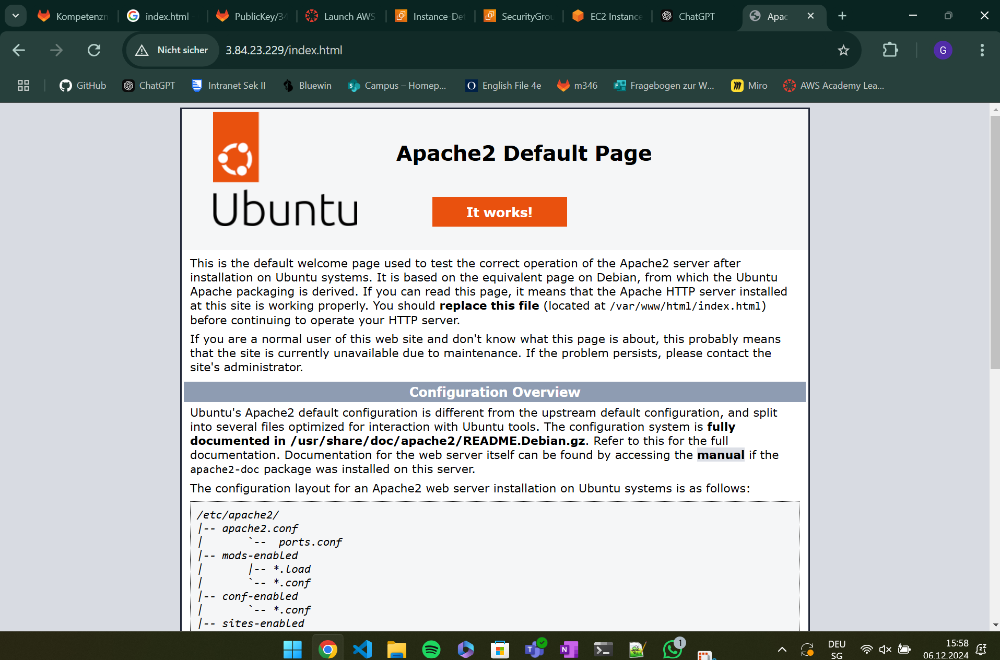
#### db.php
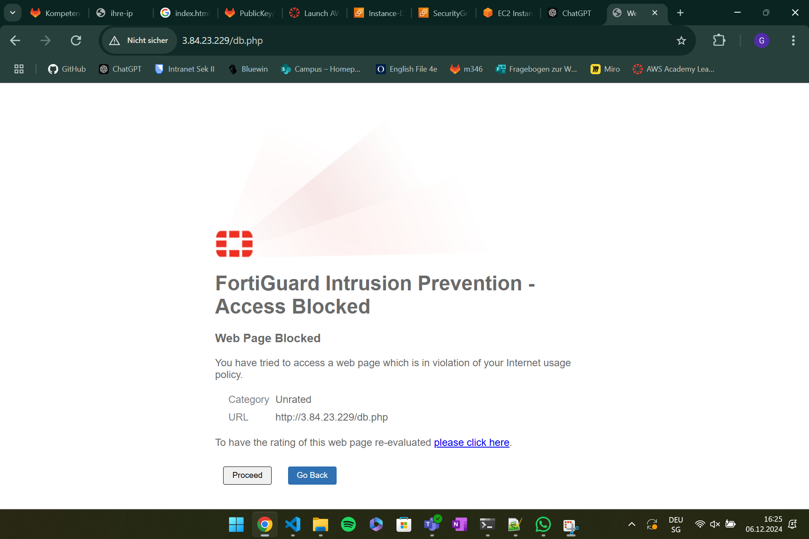
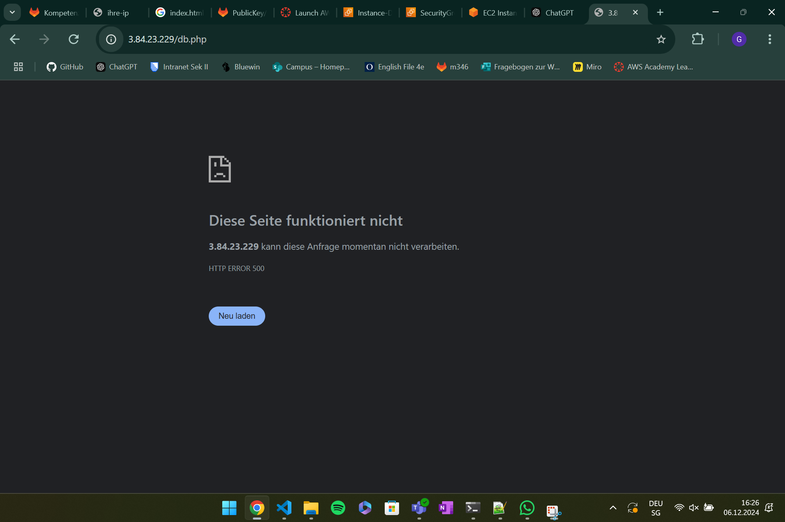
Ich konnte mich mit dem SQL von der Konsole aus anmelden und alles anzeigen lassen, die website hat es trotz allem nicht zugelassen
### info.php
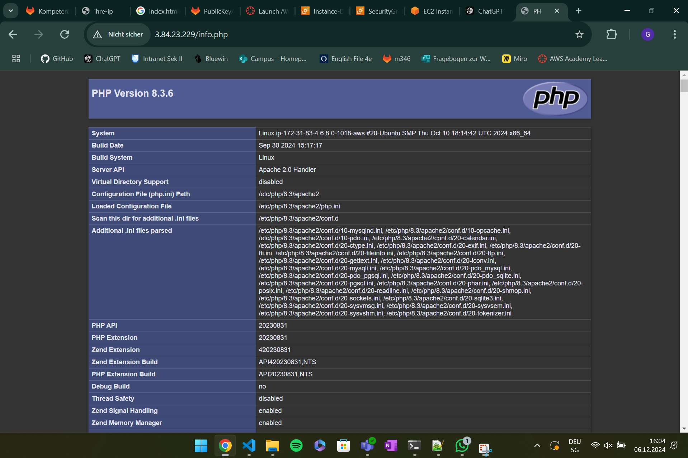
### admirer
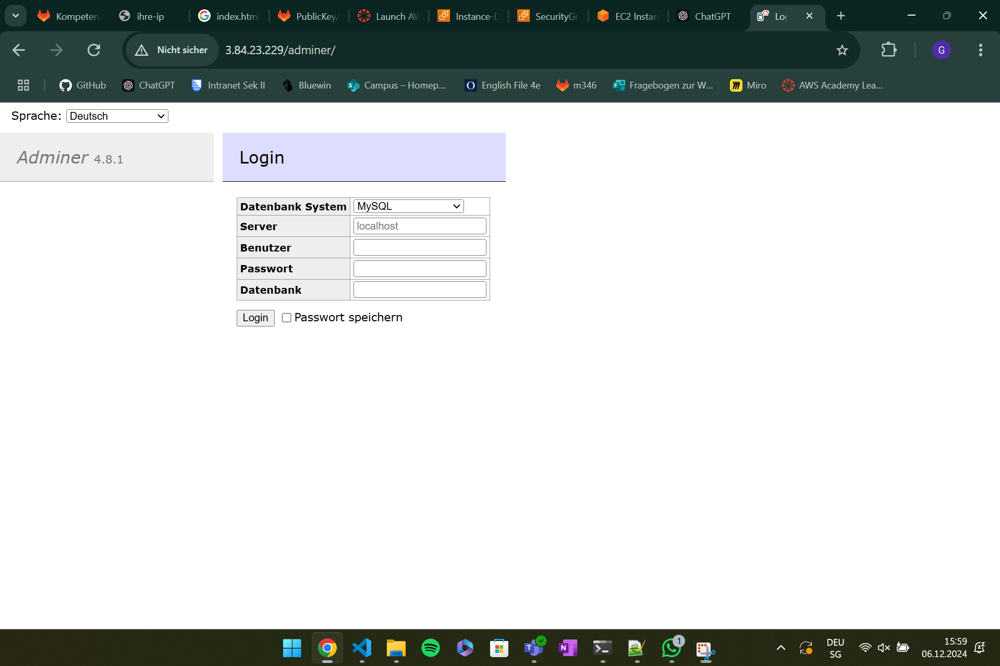
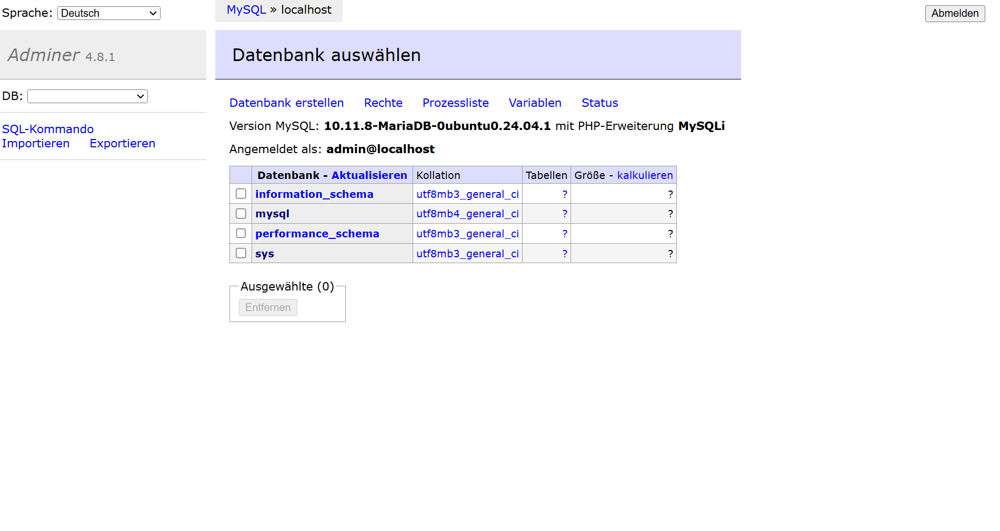

