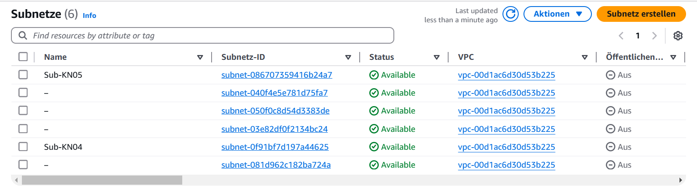
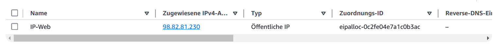
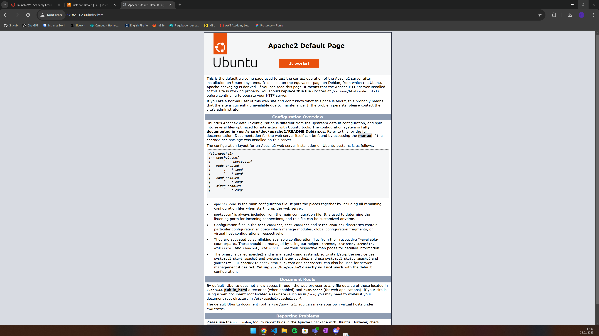

# A) Grundbegriffe und private IP wählen (30%)
## VPC:
Ein VPC ist wie ein eigenes Netzwerk in der Cloud, in dem man Geräte verbinden kann.
## Subnet:
Ein Subnet ist ein kleiner Bereich innerhalb des VPC, in dem bestimmte Geräte arbeiten.
### Meine Subnets
Ich habe noch nie ein Subnets vordefiniert.
### IP Range des VPC
Nein, die IP-Ranges der Subnetze decken nicht den gesamten IP-Range des VPC ab.

Der VPC-IP-Range ist typischerweise größer und wird in kleinere Bereiche (Subnetze) unterteilt. Zum Beispiel:

***VPC CIDR:*** 172.31.0.0/16 (enthält 65.536 Adressen)
***Subnetz CIDRs:***
Subnet 1: 172.31.0.0/20 (enthält 4.096 Adressen)
Subnet 2: 172.31.16.0/20
Subnet 3: 172.31.32.0/20
Subnet 4: 172.31.48.0/20
Subnet 5: 172.31.64.0/20
Subnet 6: 172.31.80.0/20

Die Subnetze sind Teilbereiche des VPC, und einige Bereiche innerhalb des VPC-IP-Ranges können ungenutzt bleiben.

## Öffentliche IP:
Eine öffentliche IP ist weltweit sichtbar und wird genutzt, um Geräte über das Internet zu erreichen.
## Private IP:
Eine private IP ist nur innerhalb eines lokalen Netzwerks sichtbar und nicht direkt über das Internet erreichbar.
## Statische IP:
Eine statische IP ändert sich nicht und bleibt dauerhaft einem Gerät zugewiesen.

## Subnet Liste

## Private IP-Adressen
### Web
172.31.0.10
### DB
172.31.0.20

# B) Objekte und Instanzen erstellen (70%)

## Sicherheitsgruppe
### Liste der Sicherheitsgruppe

### Inbound-Regeln
#### SG-Web

#### SG-DB

## Öffentliche, statische IP
### Elastic IP

## Instanzen erstellen
Screenshot der Liste der Instanzen, wenn beide Instanzen gestoppt sind. Die Werte der öffentlichen und private IPs und der Status (gestoppt) müssen sichtbar sein.

Screenshot der Details beider Instanzen, so dass die Subnet ID sichtbar ist. Dies kann im Screenshot oben bereits enthalten sein. Dann benötigen Sie nur einen Screenshot

### index.html

### info.php

### db.php

