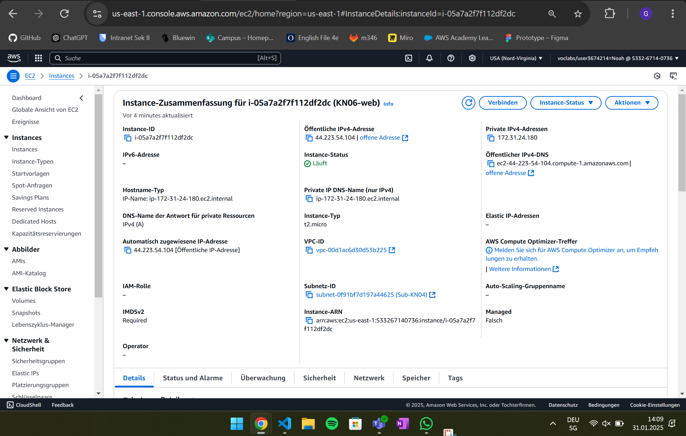
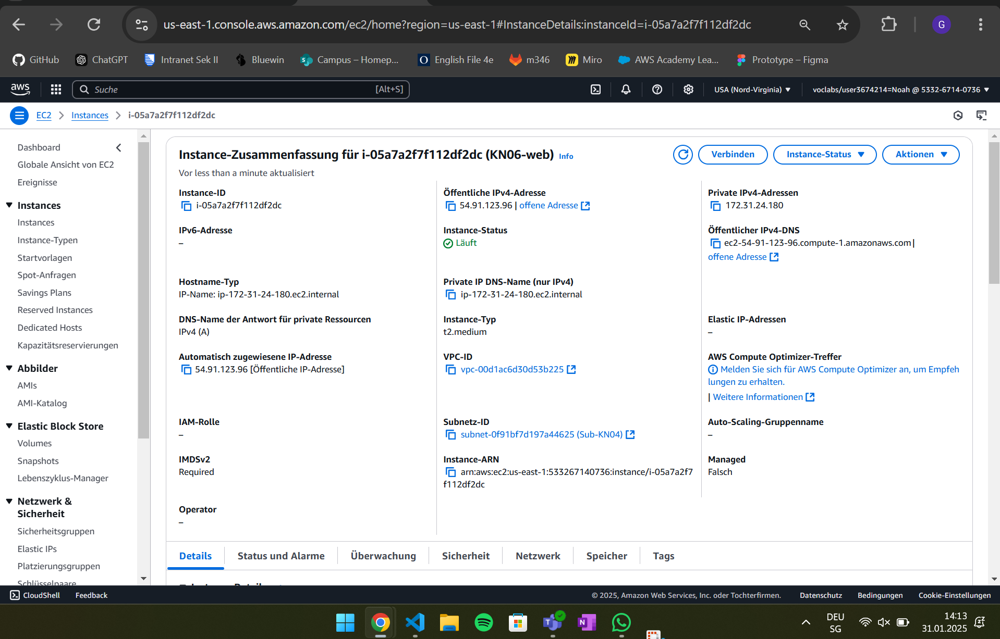
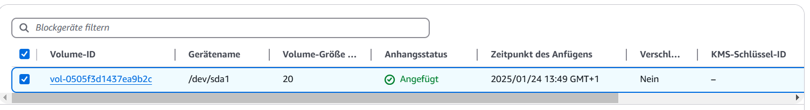

# A)
## Kurze Erklärung in eigenen Worten was ein Reverse Proxy ist.
Ein Reverse Proxy leitet Client-Anfragen an Backend-Server weiter und verbirgt deren Struktur. Er dient zur Lastverteilung, Sicherheit und Leistungsoptimierung.## Screenshot der zeigt, dass Sie die Swagger-URL aufrufen können.

## Screenshot der zeigt, dass sie den Endpoint products (Java), respGetProducts (.NET) aufrufen können (via Swagger) und auch ein korrektes Resultat bekommen.

## Screenshot einer der MongoDB Collections mit Auszug aus dem Inhalt.

# B)
## Vorher

## Erklärung
### Diskgrösse
In der Instanz unter Speicher, findet man die aktuelle Disk.

Auf die Disk klicken.

Dann oben rechts unter Aktionen > Volume ändern Volume kann man die Disk Grösse erhöhen
Dort wählt man unter Grösse: 20 aus.

### Disk Typ
Um den Instanz Typ zu ändern muss man zuerst die Instanz stoppen.

Dann unter "Aktionen > Instance Einstellungen > Instance-Typ ändern" kann man den neuen Instanztyp auswählen.

Dort gibt man dann statt t2.micro t2.medium ein.

## Nacher

