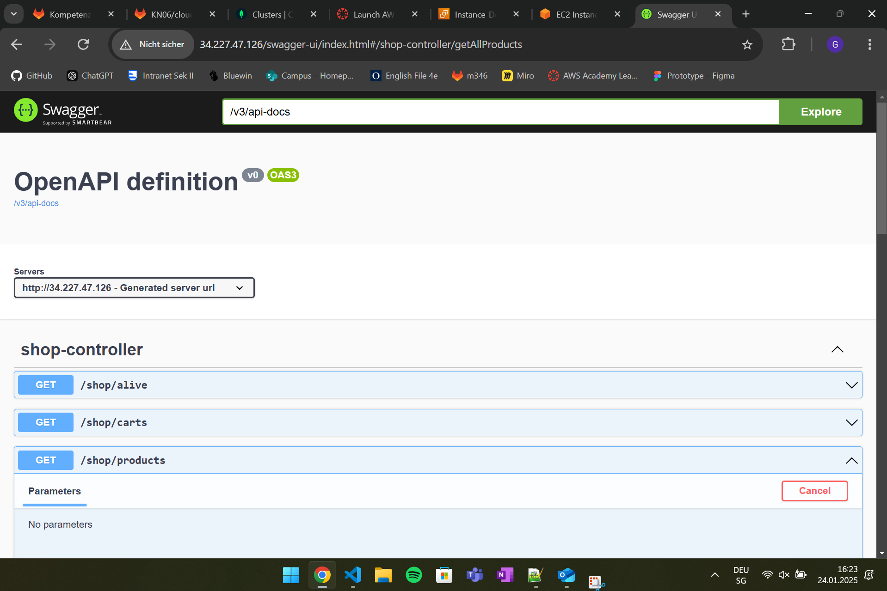
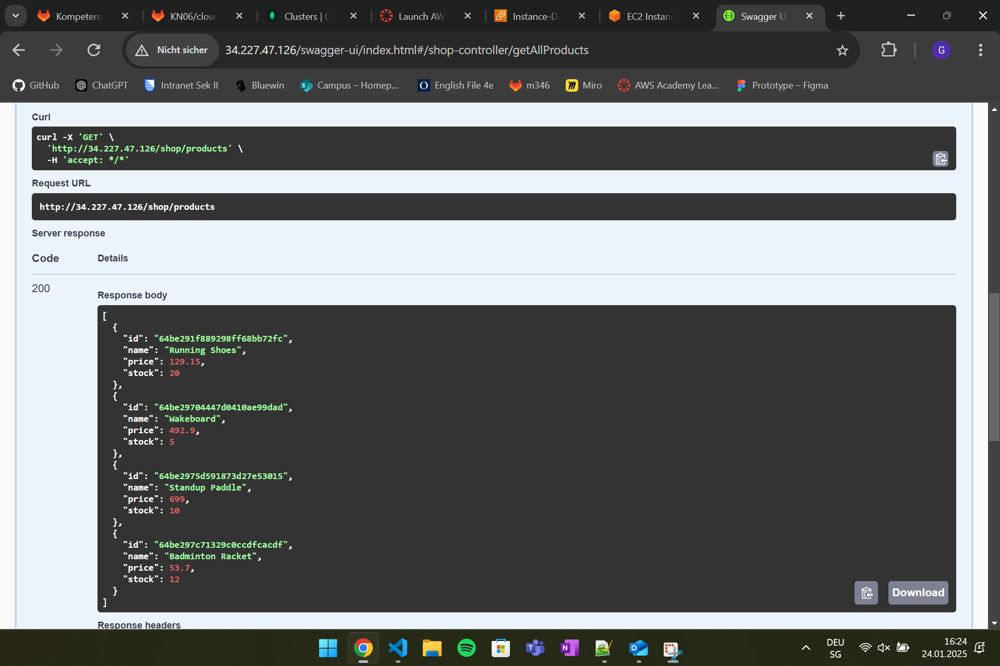
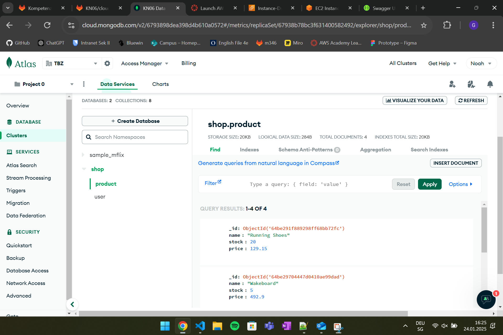

# A)
## Kurze Erklärung in eigenen Worten was ein Reverse Proxy ist.
Ein Reverse Proxy leitet Client-Anfragen an Backend-Server weiter und verbirgt deren Struktur. Er dient zur Lastverteilung, Sicherheit und Leistungsoptimierung.## Screenshot der zeigt, dass Sie die Swagger-URL aufrufen können.

## Screenshot der zeigt, dass sie den Endpoint products (Java), respGetProducts (.NET) aufrufen können (via Swagger) und auch ein korrektes Resultat bekommen.

## Screenshot einer der MongoDB Collections mit Auszug aus dem Inhalt.

