# Kostenvergleich und Bewertung von Cloud-Migrationsstrategien

## Übersicht
Dieses Dokument bietet eine Übersicht zu den Kosten und dem Aufwand der Cloud-Migrationsstrategien (IaaS, PaaS, SaaS) sowie eine Bewertung der Optionen basierend auf unseren bisherigen Anforderungen.

---

## Kostenvergleich

### Infrastructure-as-a-Service (IaaS)
#### Amazon Web Services (AWS)
- **Webserver**: 12,99 €/Monat  
  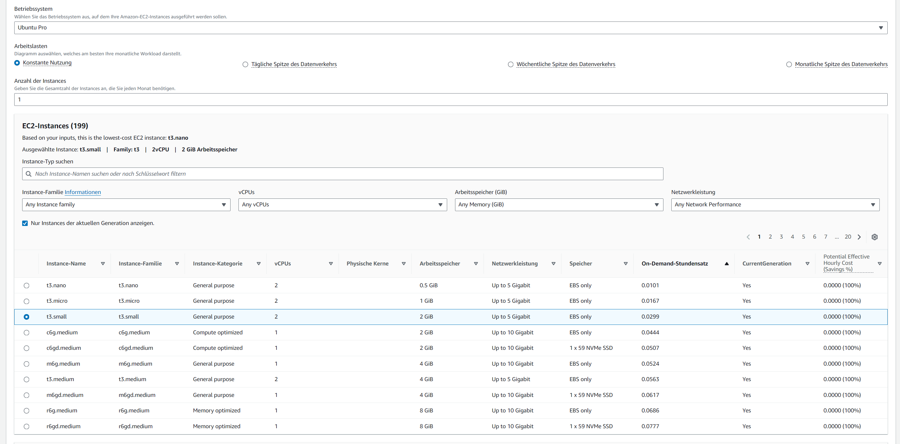
- **Datenbank**: 193,99 €/Monat  
  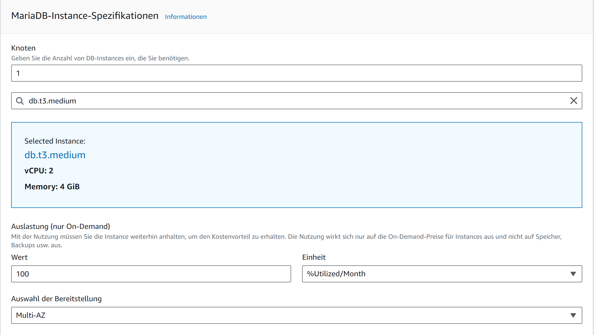
- **Backup**: 35,20 €/Monat  
  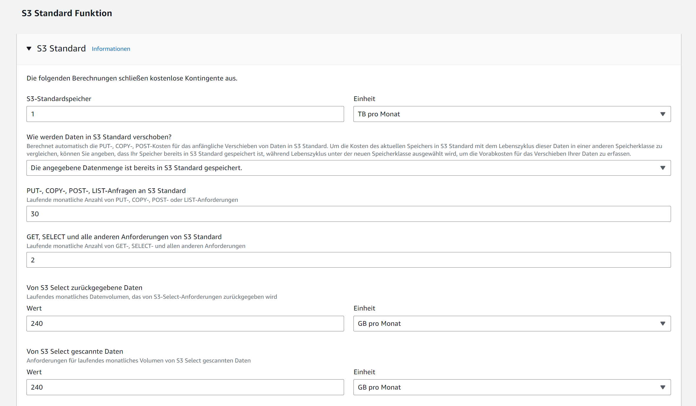  
  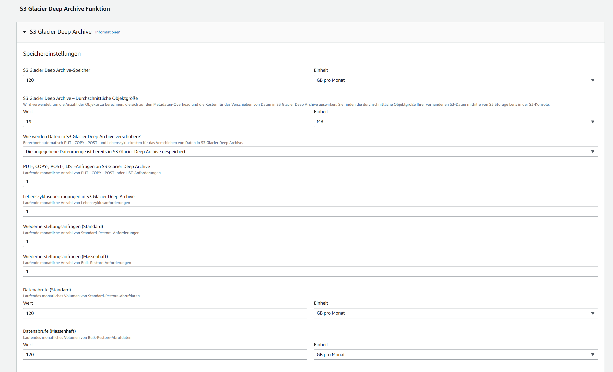  
  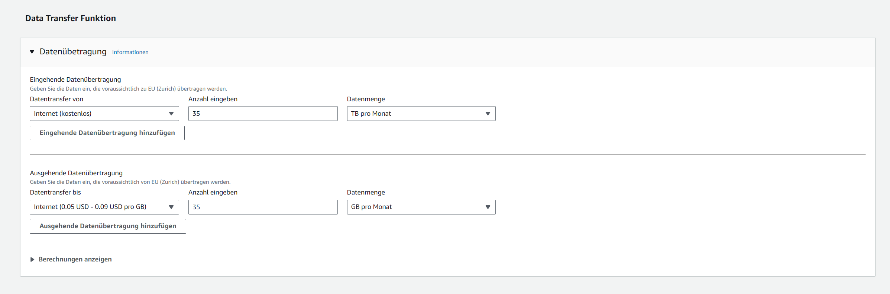
- **Gesamtkosten**: 242,18 €/Monat

#### Microsoft Azure
- **Webserver**: 12,29 €/Monat  
  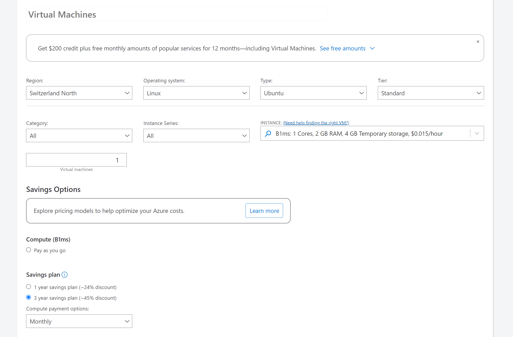  
  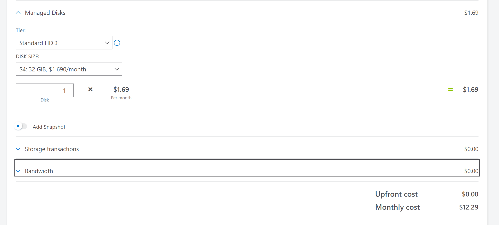
- **Datenbank**: 143,37 €/Monat  
    
  
- **Backup**: 39,60 €/Monat  
  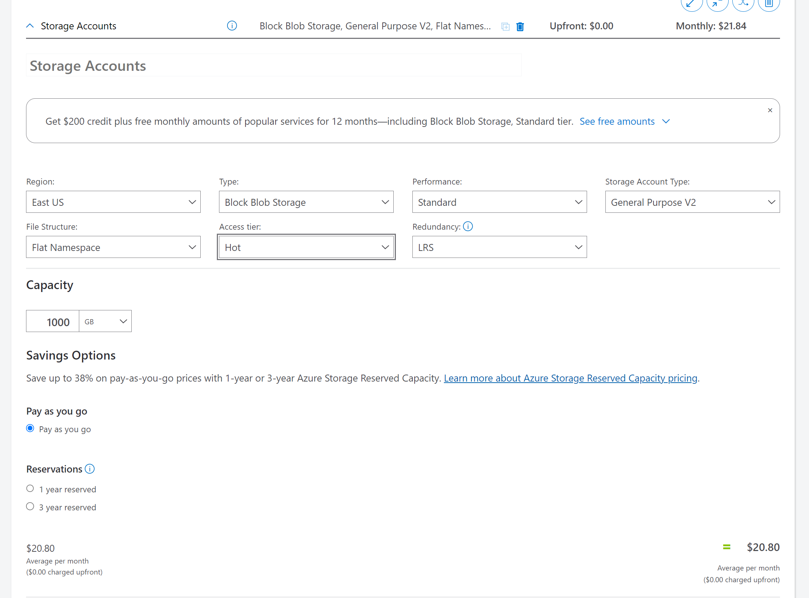
- **Gesamtkosten**: 195,26 €/Monat

### Platform-as-a-Service (PaaS)
#### Heroku
- **Production-Plan**: 50 €/Monat  
  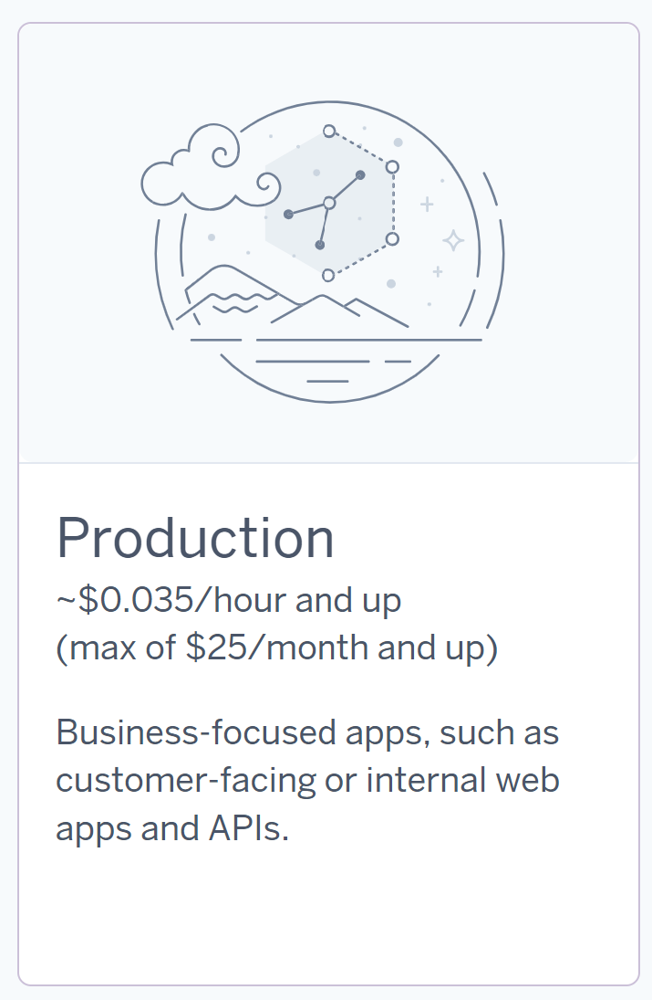
- **Standard-Option**: 50 €/Monat (ausreichend für 30 Benutzer, skalierbar)  
  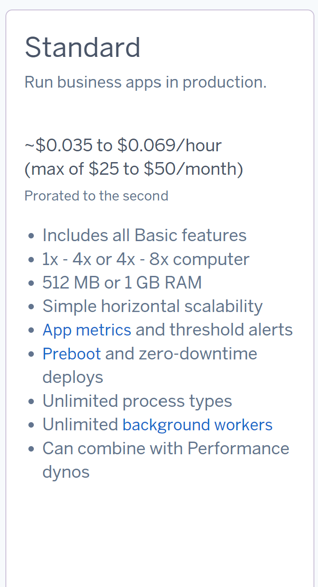
- **Backups enthalten**: Standard-Version gewählt  
  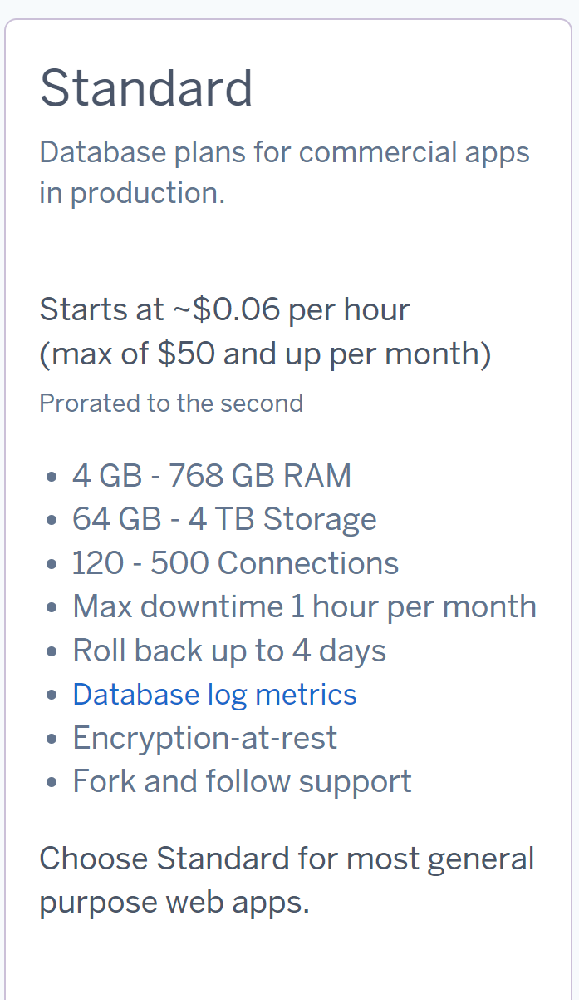
- **Optionale Zusatzdienste**: Logging/Monitoring (+10 €/Monat bei Bedarf)
- **Gesamtkosten**: 110 €/Monat

### Software-as-a-Service (SaaS)
#### Zoho CRM
- **Kosten**: 690 €/Monat (23 €/User für 30 User)  
  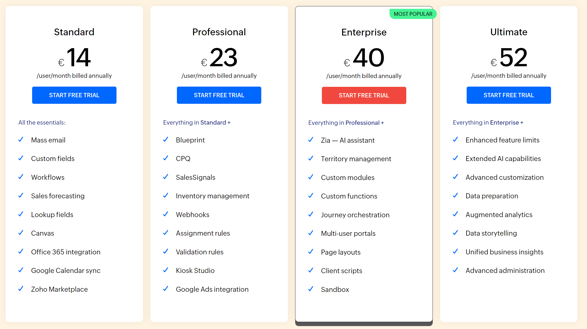
- **Empfohlener Plan**: Professional
- **Funktionen**: Alle wichtigen CRM-Funktionen inklusive Automatisierungen
- **Vorteil**: Gute Balance zwischen Kosten und Funktionen

#### Salesforce
- **Kosten**: 750 €/Monat (25 €/User für 30 User)  
  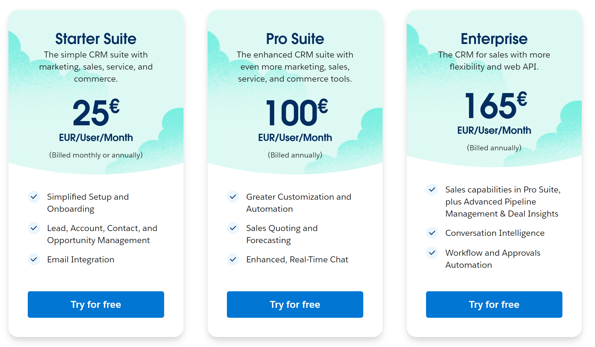
- **Empfohlener Plan**: Starter Suite
- **Funktionen**: Grundlegende CRM-Funktionen, die unseren Anforderungen entsprechen
- **Vorteil**: Höhere Anpassungsmöglichkeiten

---

## Erklärung zur Auswahl der Cloud-Komponenten und Abweichungen zur bisherigen On-Premise-Infrastruktur

### 1. Webserver
#### On-Premise Infrastruktur
- 1 Core, 2 GB RAM, 20 GB Speicher, Ubuntu.
- Einfach konfigurierter Webserver zur Bereitstellung der Anwendung.

#### Cloud-Komponente
- **AWS**: Amazon EC2 (t3.small: 2 vCPUs, 2 GiB RAM, Reservierungslaufzeit 3 Jahre).
- **Azure**: Virtual Machine (B1ms: 1 vCPU, 2 GB RAM, 4 GB Temporary Storage, S4 32 GiB, Saving Plan 3 Jahre (~45% Rabatt)).

#### Abweichungen und Gründe
- **Gründe für die Abweichungen**:
  - Cloud-Instanzen bieten mehr Ressourcen als unsere On-Premise-Server.
  - Günstigste Instanzen gewählt, die den Anforderungen entsprechen.
- **Vorteile**:
  - Skalierbarkeit: Ressourcen können bei Bedarf schnell angepasst werden.

### 2. Datenbankserver
#### On-Premise Infrastruktur
- 2 Cores, 4 GB RAM, 100 GB Speicher, Ubuntu.
- Datenbankserver wurde manuell verwaltet.

#### Cloud-Komponente
- **AWS**: Amazon RDS (db.t3.medium: 2 vCPUs, 4 GiB RAM, 100 GB Storage).
- **Azure**: Azure SQL Database (General Purpose, 2 vCores, 4 GB RAM, 100 GB Speicher, Savings Plan 3 Jahre reserved, Azure Hybrid Benefit SQL-Licence).

#### Abweichungen und Gründe
- **Gründe für die Abweichungen**:
  - Statt manueller Verwaltung wurde ein Managed Database Service gewählt.
  - Managed Services bieten Vorteile wie automatisierte Backups und Upgrades.
- **Vorteile**:
  - Optimierte Umgebung für Datenbanken.

### 3. Backups
#### On-Premise Infrastruktur
- Manuelle Speicherung der Backups auf lokalem Speicher.
- **Backup-Plan**:
  - Täglich für die letzten 7 Tage.
  - Wöchentlich für den letzten Monat.
  - Monatlich für die letzten 3 Monate.

#### Cloud-Komponente
- **AWS**:
  - Tägliche Backups: Amazon S3 Standard.
  - Wöchentliche Backups: Amazon S3 Infrequent Access.
  - Monatliche Backups: Amazon S3 Glacier (bzw. Deep Archive).
- **Azure**:
  - Tägliche Backups: Blob Storage Hot Tier.
  - Wöchentliche Backups: Blob Storage Cool Tier.
  - Monatliche Backups: Blob Storage Archive Tier.

#### Abweichungen und Gründe
- **Gründe für die Abweichungen**:
  - Abgestufte Speicherlösungen reduzieren die Kosten.
  - Sicherheit durch redundante Speicherung in mehreren Regionen.
- **Vorteile**:
  - Günstigere Speicherkosten für selten benötigte Backups.

---

## Aufwand für die Firma

### Aufwand nach Strategie
- **AWS, Azure (IaaS)**:
  - Höherer technischer Aufwand für Einrichtung, Datenmigration und Verwaltung.
- **Heroku (PaaS)**:
  - Reduzierter Verwaltungsaufwand durch automatisierte Plattformdienste.
- **Zoho CRM, Salesforce (SaaS)**:
  - Minimaler technischer Aufwand, Fokus liegt auf Schulung und Integration.

### Erklärung der Unterschiede im Aufwand
1. **Technische Anforderungen**:
   - AWS und Azure erfordern manuelle Migration und Wartung.
   - Heroku bietet vorgefertigte Plattformdienste.
   - Zoho CRM und Salesforce minimieren den technischen Aufwand.
2. **Schulung und Einarbeitung**:
   - SaaS-Lösungen benötigen Endbenutzerschulung.
   - IaaS- und PaaS-Lösungen erfordern primär Einarbeitung für die IT.
3. **Langfristige Wartung**:
   - AWS, Azure und Heroku: Firma trägt Verantwortung für Updates und Sicherheit.
   - Zoho CRM und Salesforce: Wartung wird vom Anbieter übernommen.

---

## Vergleich nach Kosten

- **AWS (Rehosting)**: 242,18 €/Monat
- **Azure (Rehosting)**: 195,26 €/Monat
- **Heroku (Replatforming)**: 110 €/Monat
- **Zoho CRM (SaaS)**: 690 €/Monat
- **Salesforce (SaaS)**: 750 €/Monat

### Warum sind die Kosten unterschiedlich?
1. **Flexibilität vs. Fertige Lösung**:
   - AWS, Azure, Heroku: Flexible Lösungen, erfordern jedoch mehr Aufwand.
   - Zoho CRM und Salesforce: Fertige Lösungen mit minimalem Verwaltungsaufwand.
2. **Angebot und Spezialisierung**:
   - AWS und Azure bieten Infrastruktur, während Zoho und Salesforce spezialisierte CRM-Funktionen bereitstellen.
3. **Skalierung und Zusatzdienste**:
   - AWS und Azure bieten flexible Skalierung mit zusätzlichen Kosten.
   - SaaS-Pläne beinhalten alle Funktionen, sind jedoch weniger anpassbar.

---

## Empfehlung

- **Flexibilität und Kontrolle**: AWS oder Azure. Azure ist preislich günstiger.
- **Geringer Aufwand und schnelles CRM**: Zoho CRM, da es günstiger als Salesforce ist und alle erforderlichen Funktionen bietet.
- **Mischung aus moderatem Aufwand und Entwicklungsumgebung**: Heroku.
